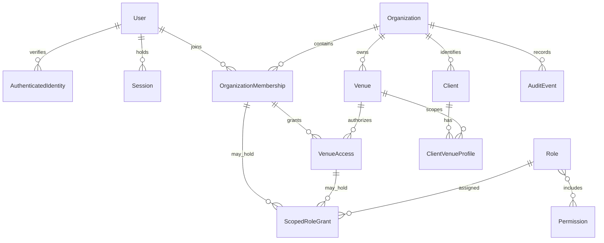

# ProjectX independent persistence model — FOUND-TASK-003

**APPROVED PROJECTX DECISION:** PostgreSQL shared schema with explicit Organization and Venue keys, RLS plus application authorization (ADR-0003). This document is an **INFERRED ProjectX design contract**, not an observation of the reference application's database. CONFIRMED evidence is limited to visible reservation/client/shift/table relationships and user/venue controls. Actual reference IDs, schema, indexes, ORM, transactions and persistence topology are UNKNOWN. All logical contracts below are NEEDS TESTING when implemented.

## Logical foundation and keys

Prefer UUIDv7 generated in a trusted application boundary for new ProjectX IDs. Compared with UUIDv4 it improves time locality while remaining opaque; unlike bigint sequences it does not disclose row counts or require one allocator; unlike ULID it uses native PostgreSQL `uuid` and standard binary comparison. UUIDv7's timestamp component leaks approximate creation time, so never treat an ID as a security token. UUIDv4 remains acceptable for random session identifiers/secrets; session cookies must be cryptographically random, not UUIDv7. The library/version and generation correctness require isolated tests before adoption. No reference ID format is inferred.

Standard authoritative timestamps are `timestamptz` UTC instants: `created_at`, `updated_at` for mutable records and `revoked_at`, `disabled_at`, `expires_at`, `deleted_at` only where lifecycle warrants. UTC refers to the instant representation; PostgreSQL `timestamptz` stores an instant and display sessions must use UTC explicitly. `created_by`/`updated_by` capture actor for mutable sensitive records where useful; append-only audit is authoritative for privileged change history. An integer `version` incremented on each mutable update supports conditional edits; immutable records omit it. Venue-local schedule times, business dates, timezone identifier and DST ambiguity policy are distinct from event instants; future Reservation/Shift tasks must select explicit conversion and invalid/ambiguous local-time handling.

### Minimum logical relationships, not finalized tables

- `User` (ENT-043) is global identity with disabled state; `AuthenticatedIdentity` (PX-ENT-001) binds unique verified `(issuer, subject)` to one User. No email uniqueness as an authentication guarantee. `Session` (PX-ENT-006) belongs to User and can be revoked independently; store only a hash of the opaque session token if persisted.
- `Organization` (PX-ENT-002) is primary tenant. `Venue` (ENT-044) belongs to exactly one Organization; changing parent requires explicit migration review. `OrganizationMembership` (PX-ENT-003) joins User and Organization with independently revocable status. `VenueAccess` (PX-ENT-004) joins membership to Venue in the same Organization and is independently revocable. Membership alone does not grant Venue rights.
- `Role` (ENT-032) and `Permission` (ENT-024) are separately modeled: Permission is a stable global capability vocabulary; Role is a scope-specific Organization or Venue grouping. A scoped role grant (PX-ENT-005) links Role to either the matching membership or explicit VenueAccess, never both; the role-permission association is conceptually many-to-many, constrained so a role only carries capabilities permitted at its scope. This uses one typed scoped-grant model rather than duplicated membership_role_grants and venue_role_grants. Physical enforcement may use split tables if checks/foreign keys cannot make the single-grant model safe; do not weaken invariant for fewer tables.
- `Client` (ENT-006) is an Organization-scoped shared identity. `ClientVenueProfile` (PX-ENT-008) is a Venue-scoped operational child with composite ownership to Client and Venue. Shared contact details require separately reviewed field minimization and consent; venue notes/preferences/visits belong to venue children, not the shared identity. Reservation history remains venue-scoped by Reservation ownership. Cross-Venue history requires explicit Organization permission and secure read path; no venue user can infer other Venue notes through Client lookup.
- `AuditEvent` (PX-ENT-007) is append-only with actor, Organization and optional Venue, action, target, result, correlation ID and UTC timestamp. `IdempotencyRecord` (PX-ENT-009) is a separate tenant-scoped command dedupe concept; no endpoint or table implemented.

## Tenant keys and referential integrity

- Organization-owned operational rows require `id`, `organization_id NOT NULL` and a foreign key to Organization. Venue-owned rows require both `organization_id NOT NULL` and `venue_id NOT NULL`; `venue_id` alone never establishes tenant scope. Use composite `(organization_id, venue_id)` to reference a Venue's unique `(organization_id, id)` where practical, and composite `(organization_id, client_id)` for Venue children referencing Client. A Reservation's Organization must equal its Venue's parent Organization. These constraints are enforced in the database as well as application logic.
- Keep global User and AuthenticatedIdentity outside tenant data but restrict them by SELF or privileged access policy; Organization and Venue bootstrap are privileged. Where Venue ownership is not yet evidenced, entity-registry.json records `UNKNOWN` rather than forcing a tenant key.
- Prefer restrictive foreign keys and explicit domain lifecycle transitions. No broad cascading delete of Reservations, Clients, memberships, audit, payments, integrations or Venue. Internal ephemeral join rows may cascade on a safe hard delete only after referential and audit review. `SET NULL` only for genuinely optional historical links whose removal cannot erase tenant ownership. Tenant parent keys must never become nullable through deletion.
- Use unique `(issuer, subject)` identity mapping, unique active User/Organization membership and active membership/Venue access, stable permission ID, unique scoped role identity and scoped idempotency keys. PostgreSQL partial unique indexes can enforce active-only uniqueness, but revival versus new-history semantics are NEEDS TESTING. Avoid premature uniqueness assumptions for guest name/email or reservation time.

## Lifecycle and retention

| Record family | Default treatment | Why |
|---|---|---|
| User / Client | Disable or anonymize by reviewed privacy workflow; do not casually hard delete | Memberships, Reservations and audit history need referential continuity; exact retention UNKNOWN. |
| Membership / Venue Access | Revocation timestamp; retain grant history and audit | Immediate rights removal with traceability; avoid ambiguous resurrected grants. |
| Reservation / payment-adjacent record | Retention controlled, explicit status transition; no universal soft delete | Historical service/financial integrity; legal retention UNKNOWN. |
| Configuration | Version/change audit; archive where needed | Shift/layout changes may affect future and historical interpretation. |
| AuditEvent | Append only; restricted retention/purge process | Never permit ordinary app UPDATE/DELETE; legal duration UNKNOWN. |
| Import staging / integration secret | Short controlled retention, hard delete or rotate after processing when safe | Sensitive raw payloads should not become permanent fixtures. |
| Sessions / idempotency records | Expire/revoke and purge by bounded retention | Never use as immutable business history. |

Soft delete is not a blanket table convention. PII deletion/anonymization, audit redaction, backup retention and statutory periods need owner/legal policy before implementation, not invented here.

## Secrets and indexing boundary

Prefer a managed secret store for integration credentials, webhook secrets and signing material; only store an encrypted reference or encrypted value in PostgreSQL when the later integration task proves the need. Restrict decryption to a narrow service identity, rotate and version keys, redact logs/backups and never persist plaintext OIDC tokens, refresh tokens, card secrets or API keys in ordinary tenant tables. Whether refresh tokens must be retained is UNKNOWN pending IdP choice. Audit records contain identifiers and outcomes, never raw secrets or guest payloads.

Index reviews begin with tenant-leading `organization_id`, `venue_id` for venue tables, composite FKs, unique constraints and measured operational predicates such as status/time, Client search and Reservation service date. Do not infer actual index definitions or text-search strategy without query plans and privacy review; final performance indexes are NEEDS TESTING.

## Module boundaries and FOUND-TASK-004 input

All 46 discovery candidate entities are classified once in entity-registry.json; their owning modules are **INFERRED planning boundaries**. Domain tasks later define attributes, keys and constraints beyond the tenant ownership/relationship rules here. FOUNDATION inputs for FOUND-TASK-004: UUIDv7 default public IDs, UTC instant timestamps plus explicit Venue timezone/service date, Organization/Venue composite ownership, transaction-local RLS context, restricted runtime DB role, version-precondition writes, scoped idempotency, versioned forward migrations and multi-tenant fixtures. Persistence failures must be translated to safe REST errors (e.g., ownership masked as 404, version conflict 409/412, uniqueness conflict 409, malformed scope denied) without leaking tenant existence. No navigation shell, API, migration or application scaffold is created in this task.
