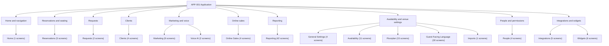

# Complete application module map

Ten domains and all 16 observed modules. Screen, component, and action IDs are exhaustive in `../app-map.json`.

```mermaid
flowchart TB
  APP["APP-001 Application"]
  DOM_01["Home and navigation"]
  APP --> DOM_01
  MOD_01["Home (1 screens)"]
  DOM_01 --> MOD_01
  DOM_02["Reservations and seating"]
  APP --> DOM_02
  MOD_02["Reservations (5 screens)"]
  DOM_02 --> MOD_02
  DOM_03["Requests"]
  APP --> DOM_03
  MOD_03["Requests (2 screens)"]
  DOM_03 --> MOD_03
  DOM_04["Clients"]
  APP --> DOM_04
  MOD_04["Clients (4 screens)"]
  DOM_04 --> MOD_04
  DOM_05["Marketing and voice"]
  APP --> DOM_05
  MOD_05["Marketing (8 screens)"]
  DOM_05 --> MOD_05
  MOD_06["Voice AI (2 screens)"]
  DOM_05 --> MOD_06
  DOM_06["Online sales"]
  APP --> DOM_06
  MOD_07["Online Sales (4 screens)"]
  DOM_06 --> MOD_07
  DOM_07["Reporting"]
  APP --> DOM_07
  MOD_08["Reporting (42 screens)"]
  DOM_07 --> MOD_08
  DOM_08["Availability and venue settings"]
  APP --> DOM_08
  MOD_09["General Settings (4 screens)"]
  DOM_08 --> MOD_09
  MOD_11["Availability (11 screens)"]
  DOM_08 --> MOD_11
  MOD_13["Floorplan (15 screens)"]
  DOM_08 --> MOD_13
  MOD_15["Guest-Facing Language (30 screens)"]
  DOM_08 --> MOD_15
  MOD_16["Imports (1 screens)"]
  DOM_08 --> MOD_16
  DOM_09["People and permissions"]
  APP --> DOM_09
  MOD_14["People (4 screens)"]
  DOM_09 --> MOD_14
  DOM_10["Integrations and widgets"]
  APP --> DOM_10
  MOD_10["Integrations (5 screens)"]
  DOM_10 --> MOD_10
  MOD_12["Widgets (6 screens)"]
  DOM_10 --> MOD_12
```
