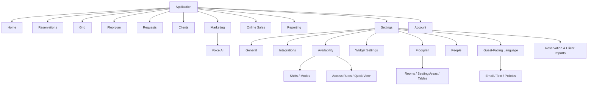

# Navigation tree

Observed top-level navigation and settings groups. All 144 screen routes and nested parent references are in `../app-map.json`.

```mermaid
flowchart TB
  APP["Application"] --> HOME["Home"]
  APP --> RES["Reservations"]
  APP --> GRID["Grid"]
  APP --> FLOOR["Floorplan"]
  APP --> REQ["Requests"]
  APP --> CLIENT["Clients"]
  APP --> MARKET["Marketing"]
  APP --> SALES["Online Sales"]
  APP --> REPORT["Reporting"]
  APP --> SETTINGS["Settings"]
  APP --> ACCOUNT["Account"]
  MARKET --> VOICE["Voice AI"]
  SETTINGS --> GENERAL["General"]
  SETTINGS --> INTEGRATIONS["Integrations"]
  SETTINGS --> AVAIL["Availability"]
  SETTINGS --> WIDGETS["Widget Settings"]
  SETTINGS --> FLOORSET["Floorplan"]
  SETTINGS --> PEOPLE["People"]
  SETTINGS --> LANG["Guest-Facing Language"]
  SETTINGS --> IMPORTS["Reservation & Client Imports"]
  AVAIL --> SHIFTS["Shifts / Modes"]
  AVAIL --> RULES["Access Rules / Quick View"]
  FLOORSET --> AREAS["Rooms / Seating Areas / Tables"]
  LANG --> COMMS["Email / Text / Policies"]
```
