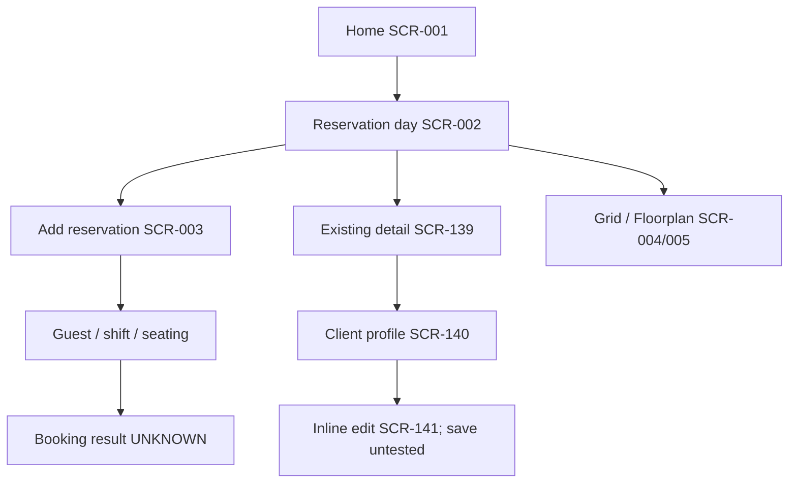
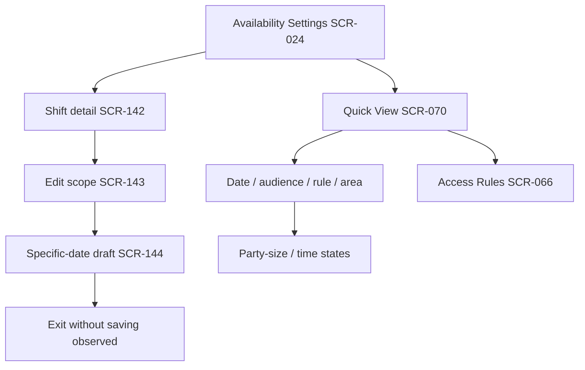
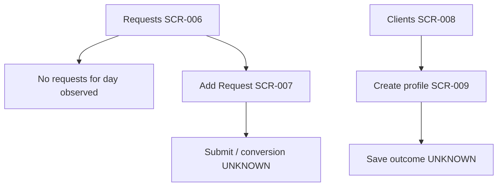

# User journey map

Read-only observed paths and explicitly unverified outcomes. Screen IDs cross-reference `../app-map.json`.

```mermaid
flowchart TB
  HOME["Home SCR-001"] --> DAY["Reservation day SCR-002"]
  DAY --> ADD["Add reservation SCR-003"]
  DAY --> DETAIL["Existing detail SCR-139"]
  ADD --> GUEST["Guest / shift / seating"]
  GUEST --> UNTESTED["Booking result UNKNOWN"]
  DETAIL --> PROFILE["Client profile SCR-140"]
  PROFILE --> EDIT["Inline edit SCR-141; save untested"]
  DAY --> GRID["Grid / Floorplan SCR-004/005"]
```

```mermaid
flowchart TB
  SETTINGS["Availability Settings SCR-024"] --> SHIFT["Shift detail SCR-142"]
  SHIFT --> SCOPE["Edit scope SCR-143"]
  SCOPE --> DRAFT["Specific-date draft SCR-144"]
  DRAFT --> DISCARD["Exit without saving observed"]
  SETTINGS --> QUICK["Quick View SCR-070"]
  QUICK --> FILTER["Date / audience / rule / area"]
  FILTER --> MATRIX["Party-size / time states"]
  QUICK --> RULES["Access Rules SCR-066"]
```

```mermaid
flowchart TB
  REQUESTS["Requests SCR-006"] --> EMPTY["No requests for day observed"]
  REQUESTS --> FORM["Add Request SCR-007"]
  FORM --> OUTCOME["Submit / conversion UNKNOWN"]
  CLIENTS["Clients SCR-008"] --> CREATE["Create profile SCR-009"]
  CREATE --> SAVE["Save outcome UNKNOWN"]
```
