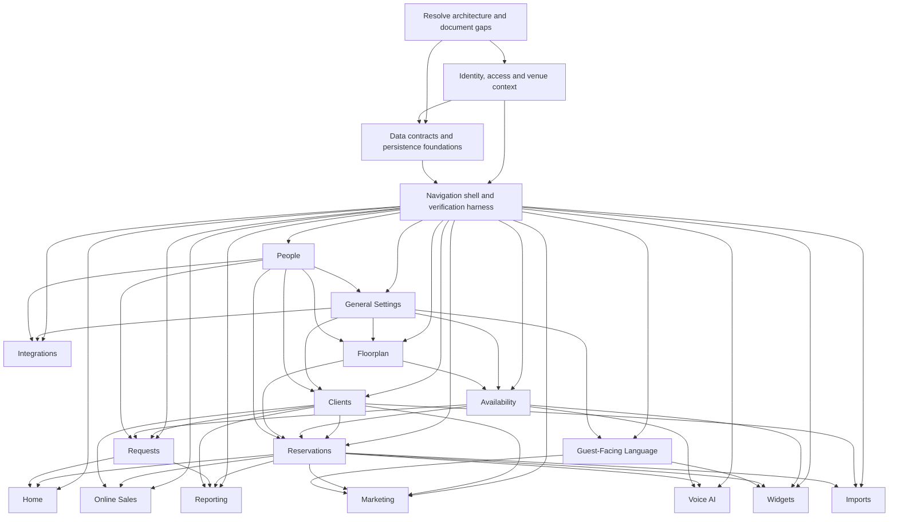

# Cross-module dependency map

Arrows mean proposed **must precede** implementation prerequisites. They do not describe the reference application's backend. Optional integration edges and reasons are in `../dependencies.json`.

