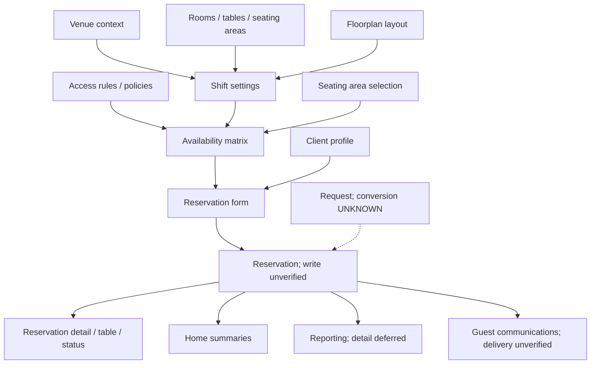

# Conceptual data-flow map

Product-level relationships from visible UI. Arrows are information dependencies, not claims about storage, APIs, service boundaries, or exact booking algorithms. Unverified writes are labeled.

