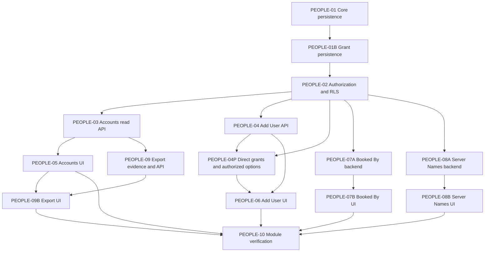

# MOD-14 People implementation decomposition

Status: PLANNED, 2026-09-28. This document changes roadmap planning only. No People code, schema, OIDC integration, API or screen was implemented. ProjectX implementation choices below are independent of the reference application's internal design.

## Evidence retained

| Screen | Route | CONFIRMED visible actions | Unknowns |
|---|---|---|---|
| SCR-025 User Accounts | `/manager/oceansatarthurs/access/user/list` | ACT-0054 Add new; ACT-0055 open user; ACT-0056 Export; roster grouped by access level, access explanation, columns Name/Job Title/Additional Options/Email Notifications | Export output, alternate roles and write outcomes UNKNOWN. |
| SCR-026 Add User | `/manager/oceansatarthurs/access/user/create` | ACT-0057 Create; ACT-0058 Create + Add Another; visible fields First/Last Name, Email, Job Title, Access Level, Email Alerts, Mobile MFA, Suspended, Granular Permissions, Email Subscriptions, Create same access at other venues | Required flags, types, validation, submission and persistence NEEDS TESTING. |
| SCR-083 Booked By Names | `/manager/oceansatarthurs/manage/bookedbynames/edit` | ACT-0167 Add new name; ACT-0168 Save changes; source name rows | Entity identity, save outcome and validation UNKNOWN. |
| SCR-084 Server Names | `/manager/oceansatarthurs/manage/servernames/edit` | ACT-0169 Add new name; ACT-0170 Save changes; server name rows | Entity identity, save outcome and validation UNKNOWN. |

FLOW-006 User account creation (SCR-025 → SCR-026): CONFIRMED entry and visible form only. Success and failure are `UNKNOWN_REQUIRES_SAFE_TEST_DATA`; cancel/back is `UNKNOWN`. The listed reference roles are visible labels, not tested grants. U-001/U-002/U-003 and alternate-role access remain unverified. Candidate entities: ENT-024 Permission, ENT-032 Role, ENT-043 User, ENT-044 Venue. ProjectX-only foundation concepts (AuthenticatedIdentity, Organization, OrganizationMembership, VenueAccess, scoped grants and sessions) remain defined in FOUND-TASK-002/003; do not assert they exist in the reference product.

## Boundary and sequence

The parent IMPL-MOD-14 is IN_PROGRESS as a planning container, not a verified module. The child tasks and their exact acceptance, commands, out-of-scope boundaries, files and unknowns are in `roadmap.json`. PEOPLE-01 is VERIFIED. PEOPLE-01B is VERIFIED after real PostgreSQL 16 CI; PEOPLE-02 is VERIFIED after real PostgreSQL 16 CI; PEOPLE-03 remains PLANNED and unstarted. A physical access model is large enough to split: PEOPLE-01 owns User/identity/Organization/Venue/membership/VenueAccess persistence; PEOPLE-01B owns Role/Permission/scoped grant persistence. RLS follows both. Booked By Names and Server Names each split into backend and frontend slices (PEOPLE-07A/07B and PEOPLE-08A/08B) because a combined schema, API and UI task would cross three layers in one session. These are justified refinements to the suggested ten-child shape.

PEOPLE-10 also depends on the backend tasks through their UI successors and directly on PEOPLE-02. Its export dependency is a **gate**, not a requirement to guess an export format: PEOPLE-09 is BLOCKED until safe evidence or an explicit ProjectX product-owner decision defines output, field scope, authorization, audit and privacy behavior. PEOPLE-09 then implements the scoped backend; PEOPLE-09B connects the SCR-025 action after both backend and list UI are ready. If export remains deferred, the parent cannot be reported as complete parity; a later explicit milestone scope change would have to document the omission and leave the action visibly unavailable. No implicit change to module scope is approved now.

## Shared fixture and identity seam

PEOPLE-04P refinement (2026-10-01): the owner approved Option A direct grants owned
by OrganizationMembership/VenueAccess, additive with unchanged reusable roles.
ADR-0009 records the narrowly required persistence, capability/RLS and PEOPLE-04
command seams. Actor-specific options expose only capability subsets the command
can consume. This is a PROJECTX IMPLEMENTATION DECISION, not SevenRooms evidence.
PEOPLE-04P and PEOPLE-06 remain BLOCKED until final PostgreSQL 16 CI passes;
PEOPLE-04/05 remain VERIFIED. No PEOPLE-06 frontend work is authorized here.

Use disposable PostgreSQL fixtures: ORG-A/VENUE-A1/VENUE-A2 and ORG-B/VENUE-B1. Identities: ORG-A admin with explicit organization grants; A1-only manager; A1+A2 cross-venue user with independent grants; A2-only user; ORG-B user; revoked membership; revoked VenueAccess; disabled User; actor with missing permission. Include known foreign object IDs and overlapping display names. Positive same-scope, wrong-venue, cross-organization, revoked, disabled, missing-capability, IDOR, and pool reuse tests must be tied to actual RLS roles, not mocks alone. No reference guest or staff records enter fixtures.

The People domain consumes a trusted authenticated identity abstraction and server-managed authorization context. No password table, mock production login or external IdP provider is added in this module. Development test contexts are isolated from serving routes. If a safe end-user route needs real OIDC before release, track that as a separately approved dependency and block that acceptance path; never make a browser-supplied identity authoritative. People may publish narrow grants and venue-context contracts needed by General Settings, Floorplan, Clients and Reservations. It does not implement those modules or change their data.

## Route and verification gates

SCR-025 changes `NOT_IMPLEMENTED` only after PEOPLE-05 passes API integration and frontend state tests; SCR-026 after PEOPLE-06; SCR-083 after PEOPLE-07B; SCR-084 after PEOPLE-08B. A screen can be IMPLEMENTED while final module regression remains pending; mark VERIFIED only after PEOPLE-10 validates route, auth, keyboard/accessibility, E2E and contract coverage. The observed Export action must remain clearly unavailable until PEOPLE-09 is resolved and verified. Backend-only tasks do not change screen status.

Each child runs focused format/lint/typecheck plus its own database, RLS, API contract, UI or E2E tests. PEOPLE-10 runs full applicable `pnpm verify` and the real PostgreSQL isolation suite (the foundation's database N/A status cannot be reused). All tests must report exact commands and results. ProjectX behavior for duplicates, user creation success, error codes and navigation will be labeled PROJECTX IMPLEMENTATION DECISION in the relevant task; no UNKNOWN reference outcome will be relabeled CONFIRMED without new evidence.
