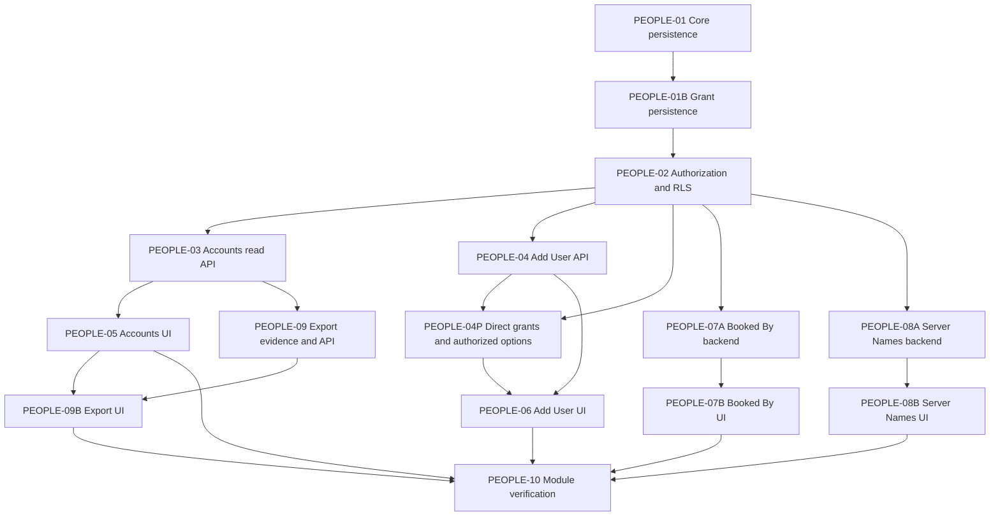

# MOD-14 People implementation decomposition

Status: PLANNED, 2026-09-28. This document changes roadmap planning only. No People code, schema, OIDC integration, API or screen was implemented. ProjectX implementation choices below are independent of the reference application's internal design.

## Evidence retained

| Screen | Route | CONFIRMED visible actions | Unknowns |
|---|---|---|---|
| SCR-025 User Accounts | `/manager/oceansatarthurs/access/user/list` | ACT-0054 Add new; ACT-0055 open user; ACT-0056 Export; roster grouped by access level, access explanation, columns Name/Job Title/Additional Options/Email Notifications | Export output, alternate roles and write outcomes UNKNOWN. |
| SCR-026 Add User | `/manager/oceansatarthurs/access/user/create` | ACT-0057 Create; ACT-0058 Create + Add Another; visible fields First/Last Name, Email, Job Title, Access Level, Email Alerts, Mobile MFA, Suspended, Granular Permissions, Email Subscriptions, Create same access at other venues | Required flags, types, validation, submission and persistence NEEDS TESTING. |
| SCR-083 Booked By Names | `/manager/oceansatarthurs/manage/bookedbynames/edit` | ACT-0167 Add new name; ACT-0168 Save changes; source name rows | Entity identity, save outcome and validation UNKNOWN. |
| SCR-084 Server Names | `/manager/oceansatarthurs/manage/servernames/edit` | ACT-0169 Add new name; ACT-0170 Save changes; server name rows | Entity identity, save outcome and validation UNKNOWN. |

FLOW-006 User account creation (SCR-025 → SCR-026): CONFIRMED entry and visible form only. Success and failure are `UNKNOWN_REQUIRES_SAFE_TEST_DATA`; cancel/back is `UNKNOWN`. The listed reference roles are visible labels, not tested grants. U-001/U-002/U-003 and alternate-role access remain unverified. Candidate entities: ENT-024 Permission, ENT-032 Role, ENT-043 User, ENT-044 Venue. ProjectX-only foundation concepts (AuthenticatedIdentity, Organization, OrganizationMembership, VenueAccess, scoped grants and sessions) remain defined in FOUND-TASK-002/003; do not assert they exist in the reference product.

## Boundary and sequence

The parent IMPL-MOD-14 is IN_PROGRESS as a planning container, not a verified module. The child tasks and their exact acceptance, commands, out-of-scope boundaries, files and unknowns are in `roadmap.json`. PEOPLE-01 is VERIFIED. PEOPLE-01B is VERIFIED after real PostgreSQL 16 CI; PEOPLE-02 is VERIFIED after real PostgreSQL 16 CI; PEOPLE-03 remains PLANNED and unstarted. A physical access model is large enough to split: PEOPLE-01 owns User/identity/Organization/Venue/membership/VenueAccess persistence; PEOPLE-01B owns Role/Permission/scoped grant persistence. RLS follows both. Booked By Names and Server Names each split into backend and frontend slices (PEOPLE-07A/07B and PEOPLE-08A/08B) because a combined schema, API and UI task would cross three layers in one session. These are justified refinements to the suggested ten-child shape.

PEOPLE-10 also depends on the backend tasks through their UI successors and directly on PEOPLE-02. Its export dependency is a **gate**, not a requirement to guess an export format. On 2026-10-04, explicit owner-approved ProjectX specification PEOPLE-D009 (ADR-0015) satisfied the planning prerequisite; PEOPLE-09 is READY, not implemented or VERIFIED. PEOPLE-09 then implements the scoped backend; PEOPLE-09B connects the SCR-025 action after both backend and list UI are verified. PEOPLE-09B/10 remain PLANNED and IMPL-MOD-14 IN_PROGRESS. No milestone omission or reference parity is approved. SevenRooms Export behavior remains UNKNOWN / NEEDS TESTING.

## PEOPLE-D009 — Owner-approved User Accounts Export specification

OWNER APPROVED / PROJECTX IMPLEMENTATION DECISION, 2026-10-04; authoritative
machine-readable contract in `decisions.json`, architectural boundary in
`docs/architecture/ADR-0015-people-accounts-export.md`. The owner chose this path
instead of further SevenRooms Export discovery. This section records specification
only; no API, migration, generated types or frontend implemented.

CSV UTF-8, immediate synchronous HTTP download; no stored export job or generated
server-side file retention. Current server-authorized Venue only, from the existing
PEOPLE-03 User Accounts roster domain, complete authorized roster with no v1
filters. PEOPLE-03 itself is organization-scoped: export must narrow to active
current-Venue membership/access without changing the existing read endpoint or
exporting its organization-wide response. Use the same ascending User UUID order
and roster field semantics, not a reference ordering/role-precedence claim.

Exact columns: **Name, Job Title, Access Level, Email Notifications**. Explicitly
exclude Email, Mobile MFA, Suspended internals, Granular Permissions, Email
Subscriptions, Organization/Venue/User IDs, AuthenticatedIdentity identifiers,
OIDC issuer/subject, internal Role/Permission IDs and audit metadata.

Dedicated canonical VENUE capability `people.accounts.export`; ordinary roster
read authority does not imply export. Scope comes only from trusted server
authorization context, never browser/client-selected tenant authority. Planned
`POST /api/v1/people/accounts/export`, strict body `{}`, 200,
`Content-Type: text/csv; charset=utf-8`, attachment filename
`people-accounts-YYYY-MM-DD.csv`. Empty roster: header only. Maximum 10,000 rows;
above it return safe 422, never a partial export.

ProjectX security decision: neutralize exported text beginning with `=`, `+`, `-`,
`@`, tab or carriage return and test CSV escaping independently; do not alter stored
data. Audit scoped attempt/result using existing conventions, only event type,
organization/venue scope, actor attribution, timestamp, success/denied/failed and
row count on success. Never audit/store CSV contents or exported field values.
Safe errors: 400 malformed request, 401 unauthenticated, 403 missing capability,
422 over limit, 500 generic generation failure. Complete generation/required audit
before sending CSV; no partial response/file on failure.

Future PEOPLE-09 acceptance covers tenant/RLS/revocation and read-only grant denial,
exact allowlist, empty/10,000/10,001 boundaries, complete deterministic order,
formula prefixes/escaping, safe errors, minimal audit and failure atomicity on
PostgreSQL 16 with `pnpm verify` and `pnpm verify:db`. Required integration seams
(capability registration, narrowed RLS/read projection, audit and API contracts)
are PEOPLE-09-owned, not a new implementation in this planning task. PEOPLE-09B
frontend remains separate and PLANNED; Export remains unavailable until verified.

ACT-0056 stays CONFIRMED visible action only. SevenRooms file format, fields,
tenant scope, filtering, permissions, delivery/download, filename, audit, retention,
failure/cancellation and alternate roles stay UNKNOWN / NEEDS TESTING. Preserve
U-001/U-002/U-003 and all other reference classifications; no parity claim.

## PEOPLE-09 audit blocker history

Historical PEOPLE-09 implementation preflight (2026-10-04): business specification PEOPLE-D009
remains APPROVED, but implementation is BLOCKED on PEOPLE-09-AUDIT-001. The only
durable People histories are name-record/version-specific CREATED/UPDATED triggers
requiring venue.manage, not reusable export attempt/result writers. No safe existing
durable denial/failure writer was found; PEOPLE-02 denies before its callback and
rolls back failed work. Per the implementation request's explicit failure rule,
stop before creating a new audit write architecture. Smallest prerequisite is
approval/design of an export-only metadata persistence/writer seam and its trusted
scope/denial attribution/failure durability tests, not a generic audit subsystem.
No code, migration, generated contract, frontend or future task was started.
PEOPLE-09B/10 remain PLANNED; IMPL-MOD-14 IN_PROGRESS and all prior VERIFIED tasks
unchanged. Specification readiness is historical; it does not override this newly
discovered implementation blocker. Reference Export and U-001/U-002/U-003 unchanged.

## PEOPLE-D010 — Export-only durable audit write seam

OWNER APPROVED / PROJECTX IMPLEMENTATION DECISION, 2026-10-04; Option A — narrow
export-only writer inside PEOPLE-09. `decisions.json` and ADR-0016 record the
approved boundary. PEOPLE-09-AUDIT-001 is now RESOLVED by PEOPLE-D010, with original
blocker evidence retained. PEOPLE-09 BLOCKED -> READY, not implemented/VERIFIED.
PEOPLE-D009 business/CSV contract unchanged; PEOPLE-09B/10 PLANNED and IMPL-MOD-14
IN_PROGRESS. No new Audit module, roadmap parent or cross-module framework.

Future PEOPLE-09 may add only export-specific append-only persistence, a narrowly
validated write function and trusted-scope transaction seam. Conceptual minimum
fields: id, organization_id, venue_id, actor_user_id, request_id, event_type,
result, exported_row_count, occurred_at. Event is fixed people.accounts.export;
results success/denied/failed only. Row count nullable and permitted only on
success, whose event includes actual row count. Row identity/request correlation
are approved audit metadata, not new CSV fields.

No runtime direct INSERT/UPDATE/DELETE or broad audit SELECT; immutable rows via
repository convention. Preferred SECURITY DEFINER writer has fixed safe
search_path, explicit validation, EXECUTE only for projectx_people_runtime, no
PUBLIC execute/generic SQL/arbitrary table or event. No BYPASSRLS, admin/migration
request pool, browser authority, arbitrary metadata or audit-read API.

Trusted resolver establishes actor/Organization/Venue/request context; parameters
must match that context and referential ownership, not browser DTOs or custom
settings alone. Validate User/Organization/Venue existence and Venue's Organization.
Existing history actor UUID attribution has no User ownership FK; if retaining
that convention, the writer explicitly validates User existence rather than
inventing lifecycle/deletion or employee/name ownership semantics.

Denial can be durable without export capability solely for auditing; this never
grants roster visibility and no export query runs after denial. Failed authorized
work rolls back, then a bounded separate failed audit persists without failure
internals or resurrecting work. Success audit/row count must persist before CSV;
audit failure prevents success, and no partial CSV is returned. No CSV/Name/Job
Title/Access Level/Email Notifications values, filename, stack/SQL, arbitrary
failure payload/metadata JSON or generated-file reference stored.

This task records architecture only: no migration/table/function/application helper,
contract/test or frontend. Future implementation requires focused PostgreSQL
attribution/isolation/immutability/durability/atomicity tests, separate exact-SHA
publication approval and final pnpm verify plus pnpm verify:db on PostgreSQL 16.
ACT-0056 stays confirmed visible action only; all Export behavior remains UNKNOWN /
NEEDS TESTING, U-001/U-002/U-003 unchanged and no reference parity claim.

## Shared fixture and identity seam

PEOPLE-04P refinement (2026-10-01): the owner approved Option A direct grants owned
by OrganizationMembership/VenueAccess, additive with unchanged reusable roles.
ADR-0009 records the narrowly required persistence, capability/RLS and PEOPLE-04
command seams. Actor-specific options expose only capability subsets the command
can consume. This is a PROJECTX IMPLEMENTATION DECISION, not SevenRooms evidence.
PEOPLE-04P and PEOPLE-06 remain BLOCKED until final PostgreSQL 16 CI passes;
PEOPLE-04/05 remain VERIFIED. No PEOPLE-06 frontend work is authorized here.

Use disposable PostgreSQL fixtures: ORG-A/VENUE-A1/VENUE-A2 and ORG-B/VENUE-B1. Identities: ORG-A admin with explicit organization grants; A1-only manager; A1+A2 cross-venue user with independent grants; A2-only user; ORG-B user; revoked membership; revoked VenueAccess; disabled User; actor with missing permission. Include known foreign object IDs and overlapping display names. Positive same-scope, wrong-venue, cross-organization, revoked, disabled, missing-capability, IDOR, and pool reuse tests must be tied to actual RLS roles, not mocks alone. No reference guest or staff records enter fixtures.

The People domain consumes a trusted authenticated identity abstraction and server-managed authorization context. No password table, mock production login or external IdP provider is added in this module. Development test contexts are isolated from serving routes. If a safe end-user route needs real OIDC before release, track that as a separately approved dependency and block that acceptance path; never make a browser-supplied identity authoritative. People may publish narrow grants and venue-context contracts needed by General Settings, Floorplan, Clients and Reservations. It does not implement those modules or change their data.

## Route and verification gates

SCR-025 changes `NOT_IMPLEMENTED` only after PEOPLE-05 passes API integration and frontend state tests; SCR-026 after PEOPLE-06; SCR-083 after PEOPLE-07B; SCR-084 after PEOPLE-08B. A screen can be IMPLEMENTED while final module regression remains pending; mark VERIFIED only after PEOPLE-10 validates route, auth, keyboard/accessibility, E2E and contract coverage. The observed Export action must remain clearly unavailable until PEOPLE-09 is resolved and verified. Backend-only tasks do not change screen status.

Each child runs focused format/lint/typecheck plus its own database, RLS, API contract, UI or E2E tests. PEOPLE-10 runs full applicable `pnpm verify` and the real PostgreSQL isolation suite (the foundation's database N/A status cannot be reused). All tests must report exact commands and results. ProjectX behavior for duplicates, user creation success, error codes and navigation will be labeled PROJECTX IMPLEMENTATION DECISION in the relevant task; no UNKNOWN reference outcome will be relabeled CONFIRMED without new evidence.
